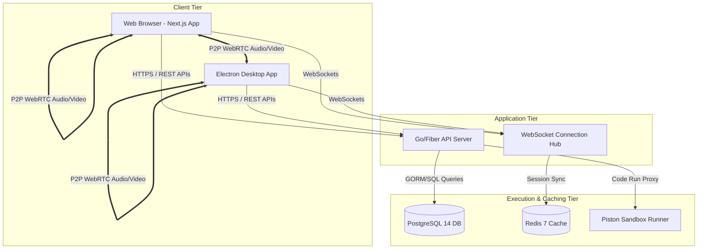
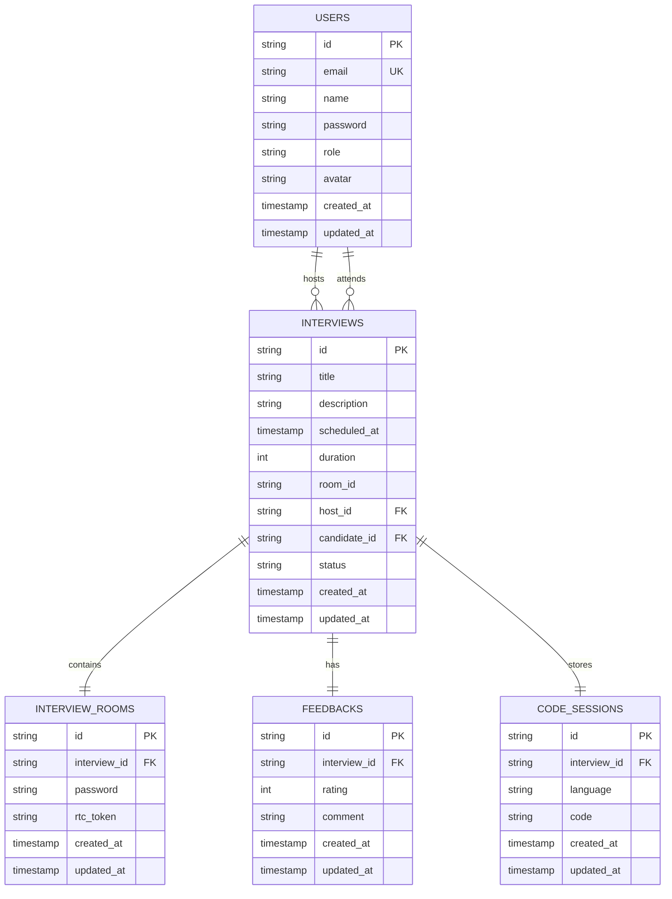
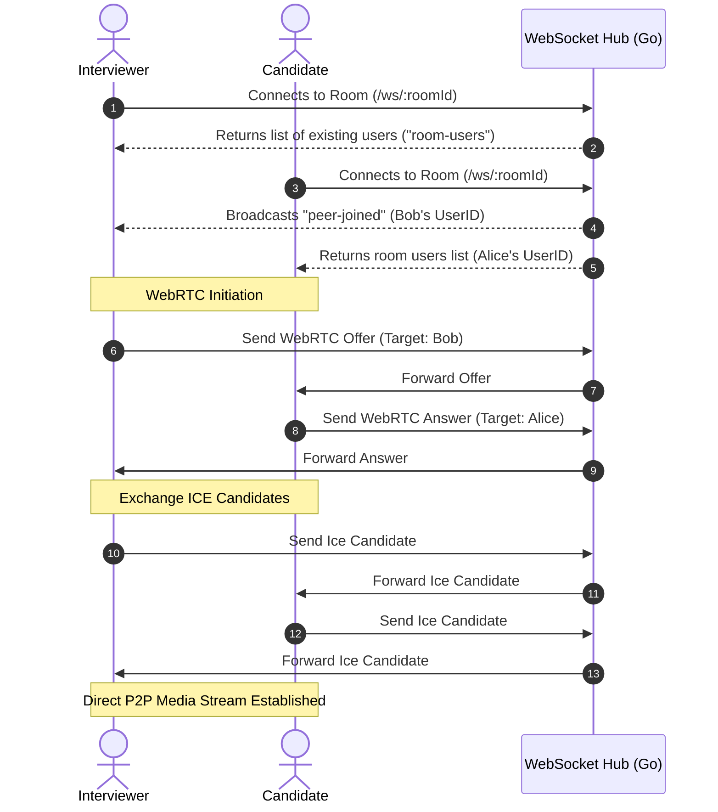
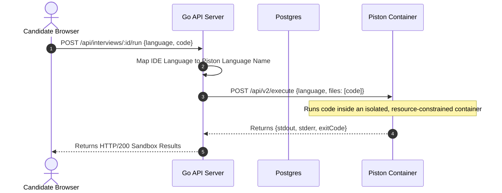
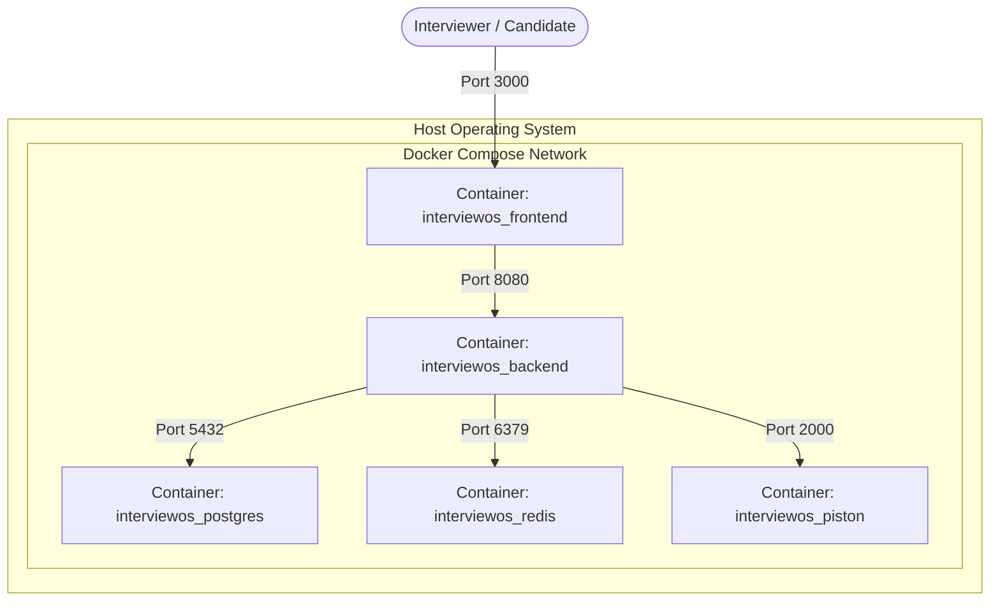
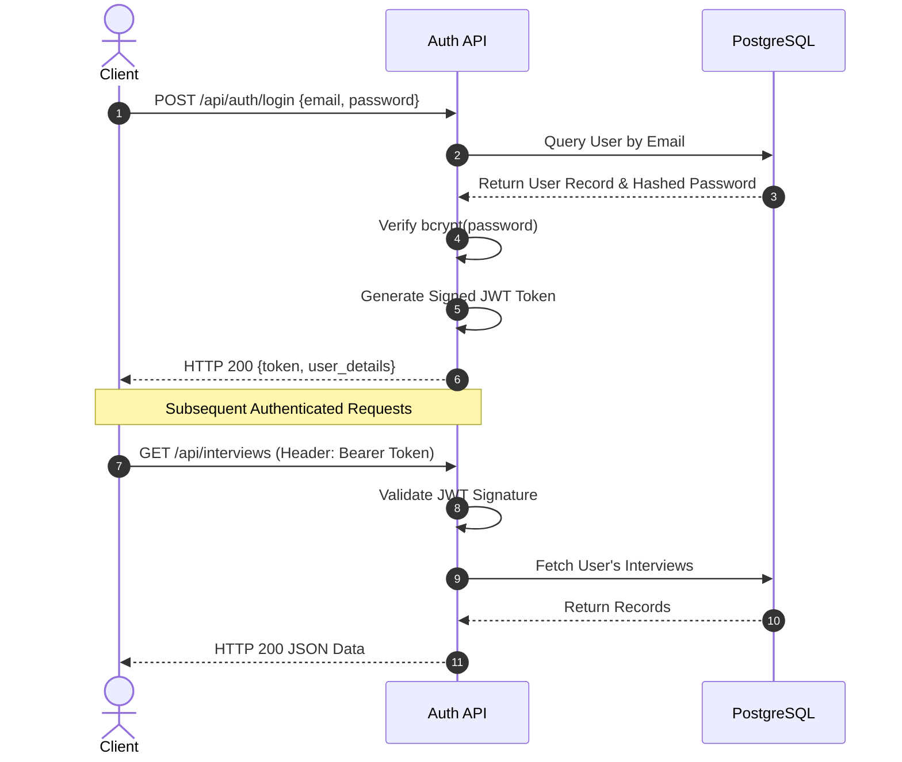
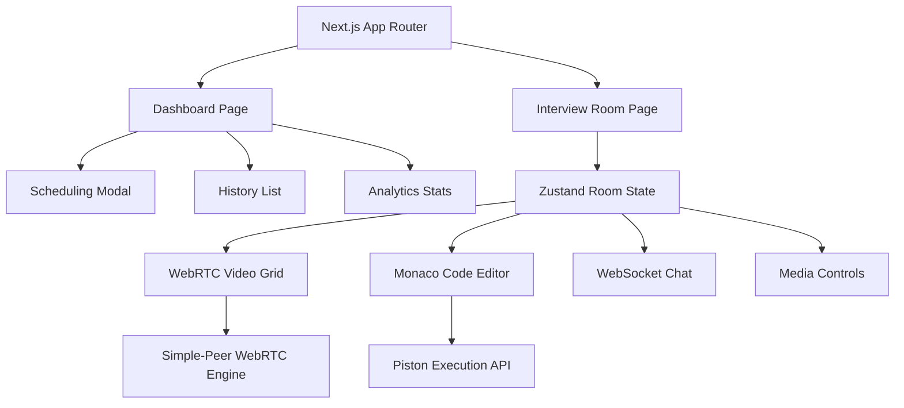
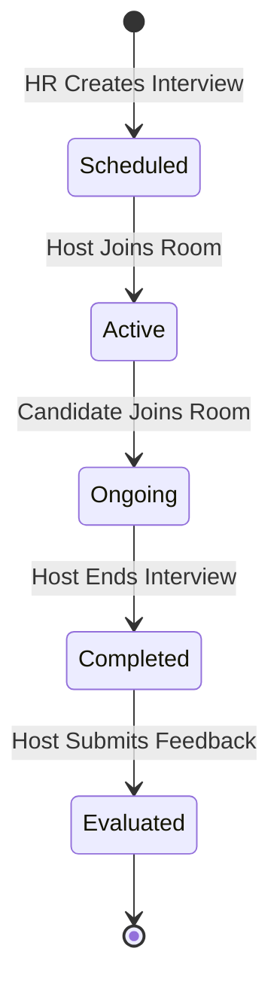

# Technical Project Report: InterviewOS
**A Collaborative Real-Time Technical Interview Platform**

---

## 1. Executive Summary

**InterviewOS** is an integrated Web-based platform designed to streamline remote technical assessments for recruiters, interviewers, and candidates. The platform combines:
1. **Real-time collaborative code editing** utilizing the Monaco Editor engine.
2. **Secure multi-peer audio/video rooms** running peer-to-peer over WebRTC.
3. **Sandboxed code execution** for multiple languages (Go, Python, JavaScript, Java, C/C++) isolated via Docker/Piston.
4. **Structured candidate scheduling and feedback workflow** inside a dashboard.

---

## 2. System Architecture

The application adopts a decoupled architecture featuring a single-page frontend application and a high-performance HTTP/WebSocket backend service, orchestrated using Docker Compose.

### Architectural Diagram

Click to view Mermaid Source Code

---

## 3. Entity Relationship Diagram (ERD)

The relational schema is backed by PostgreSQL and managed by GORM. Key relationships are illustrated below:

Click to view Mermaid Source Code

---

## 4. Key Sequences & Workflows

### 4.1. WebRTC Signaling & Connection Setup

Because WebRTC requires direct connection details (SDP offers/answers and ICE candidates) to construct a direct audio/video line, the WebSocket endpoint is used as a signaling channel.

Click to view Mermaid Source Code

### 4.2. Code Execution Flow

The platform executes code in real time without putting the host node at risk by executing it inside an isolated sandbox using the Piston library.

Click to view Mermaid Source Code

---

## 5. Docker Orchestration Flow & Container Lifecycle

The application uses **Docker Compose** to run the complete environment. This standardizes deployment, isolates service operations, and protects host environments.

### 5.1. Why Use Docker in InterviewOS?
* **Zero Host Dependencies**: Developers and administrators do not need to install complex local compilers (like GCC or Go), PostgreSQL servers, or Redis databases on the host machine.
* **Isolated Sandbox Execution**: To prevent security compromises from candidates submitting malicious code (e.g., reading local credentials or calling system utilities), the code execution engine runs inside the isolated `interviewos_piston` container with resource limits and restricted privileges.
* **Dependency Health Monitoring**: Containers synchronize startup using docker health checks. The `backend` container waits for both `postgres` and `redis` to pass health checks (`pg_isready` and `redis-cli ping`) before launching, preventing database connection timeouts.

### 5.2. Docker Compose Containers Catalog
* **`interviewos_postgres` (Port 5432)**: relational database storing users, interviews, and code sessions.
* **`interviewos_redis` (Port 6379)**: cache store used for session validations.
* **`interviewos_backend` (Port 8080)**: custom Dockerfile building the Go backend executable and running the Fiber WebSocket signaling hub.
* **`interviewos_piston` (Port 2000)**: multi-language execution engine exposing REST endpoints to build and execute code blocks.
* **`interviewos_frontend` (Port 3000)**: Next.js dev server rendering the application web interface.

### 5.3. Container Network Interaction Flow

Click to view Mermaid Source Code

---

## 6. API Reference Catalog

### 5.1. Authentication
* **`POST /api/auth/register`**: Creates user accounts with roles (`candidate`, `interviewer`).
* **`POST /api/auth/login`**: Issues Signed JWT tokens.
* **`POST /api/auth/logout`**: Authenticated logout.
* **`GET /api/auth/me`**: Returns the current session user payload.

### 5.2. Interview Schedules & Rooms
* **`GET /api/interviews`**: Fetch all scheduled interviews (supports pagination and filtering).
* **`POST /api/interviews`**: Plan and schedule a new interview event.
* **`GET /api/interviews/:id`**: Fetch deep associations for an interview (host details, candidate details).
* **`POST /api/rooms/join`**: Validate room password to gain access to WebSocket room.
* **`POST /api/interviews/:id/run`**: Send written code for sandboxed remote compilation and execution.

### 5.3. WebSocket Live Room signaling (wss://...)
* `webrtc-offer` / `webrtc-answer` / `webrtc-ice`: Signaling packets forwarded directly using target recipient fields.
* `chat-sync`: Synchronize messages between the participants.
* `code-sync`: Synchronize lines of code within Monaco Editor. Saves to PostgreSQL on changes using a background goroutine.

---

## 7. Security & Optimizations

1. **Password Hashing**: Uses `golang.org/x/crypto/bcrypt` to securely store passwords with unique salt values.
2. **Access Control**: Handlers utilize JWT authorization parsed from HTTP Bearer headers to enforce database-level access checks (e.g., Candidates cannot view interviewer feedback notes).
3. **Execution Sandbox**: Multi-language support runs in containerized environments with memory and CPU boundaries to prevent denial-of-service (DoS) loops or host compromise.
4. **WebSocket Mutex Locking**: Room creation and active client registration use synchronization mutexes (`sync.Mutex`) to prevent data race conditions on simultaneous disconnects or connects.

---

## 8. Authentication & Authorization Flow (JWT)

This sequence illustrates the stateless authentication flow used to secure API endpoints across the platform.

View Diagram

---

## 9. Frontend Component Architecture

The Next.js frontend is heavily modularized. Complex states in the interview room are managed via Zustand to prevent unnecessary re-renders of the video and code panels.

View Diagram

---

## 10. Interview Lifecycle State Machine

The state diagram below illustrates the life cycle of an interview record within the system, tracking its transition from scheduled to fully evaluated.

View Diagram

